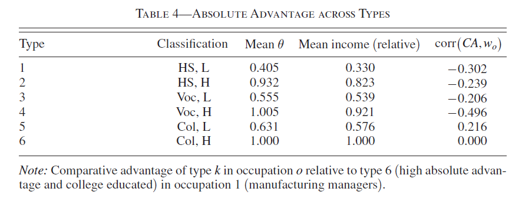

::: {.callout-note}
## Collegio Carlo Alberto Replication Project

This report was created as part of the assessment for the [Computational Economics Course](https://floswald.github.io/CompEcon/) in the PhD program at Collegio Carlo Alberto taught by [Florian Oswald](https://floswald.github.io/).
:::

## Paper and Replication Package

This report attempts a partial computational replication of:

* **Paper:** [10.1257/aer.20161925](https://doi.org/10.1257/aer.20161925)
* **Replication package:** [10.3886/E231387V1](https://doi.org/10.3886/E231387V1)

by using the **Julia** computation language.

Because the original Danish administrative data are strictly confidential, a direct numerical replication of the paper's exhibits is impossible. Therefore, I have replicated the computational structure of the first-stage EM procedure on a synthetic data-generating process (DGP).

The replication consists in the following computational results:

1.  **Synthetic DGP:** Simulating worker heterogeneity, wages, and occupational transitions.

2.  **First-Stage EM Algorithm:** Recovering unobserved comparative advantage and income parameters.

3.  **Table 4-Style Exhibit:** "Absolute Advantage Across Types" (Synthetic Analogue).

***Caveats and Observations:*** The original author provided MATLAB code for the first-stage EM estimation (downloaded from [Dropbox](https://www.dropbox.com/scl/fi/v2r6f1mqe4a1zwrsincpi/emCode.m?e=2&r=ACpsCqP7XOdsbeEDg5SC4Vl7UU-eX6MmJUJB6BUQDZm1ICT0jpU9QFewhaZzuDBR9CaAs51EGKMo89wBSup7ZZX-N4pHCLO7OR_8-73sIlBy2EPkc93QPNfY7Pf_R52o5tDf24bZyC7Uac1Ff5RJLgWXLEbAwJL5woOkzJ6XDj_fZFGEFoamsnF3sf_M2_dLS-w&sm=1&dl=0)). Since the underlying dataset and the second-stage code were not available, this project focuses exclusively on translating and validating the first-stage EM algorithm in Julia. The resulting tables are computational proofs of concept, not empirical replications since, as said before, all codes are implemented based on a synthetic dataset made from scratch.

---

## High Level Description of Computational Problem in Paper

The core computational problem in the replication process is estimating a structural model of occupational choice where workers possess an unobserved, time-invariant comparative advantage (latent type $k$). 
Since the Danish administrative data used in the original paper is confidential, this replication focuses on validating the first-stage Expectation-Maximization (EM) procedure using a synthetic Data Generating Process (DGP) designed to align wtih the paper's theoretical framework.

### 1. The Theoretical Model and the Synthetic DGP
The DGP initializes $N$ workers (defaulting to 1,000), assigning each a random starting age and a permanent latent type $k \in \{1, 2\}$ with probabilities slightly skewed to avoid perfect symmetry. 
Moreover, to rigorously test the EM algorithm, the synthetic DGP was constructed to satisfy the structural assumptions of the paper's labor supply model:

* **Wage Equation and Unobserved Heterogeneity:** Following Equation (6) and Assumption 3 of the paper, log wages depend on age, occupation-specific premiums, and the unobserved match quality between the worker's latent type and their occupation. The DGP replicates this log-linear structure:
  $$
  \log w_{itk} = \beta_0 + \beta_{age} \cdot \text{age}_{it} + \alpha_o + \gamma_{o, k} + \varepsilon_{it}
  $$
    where $\alpha_o$ is an occupation-specific wage premium, $\gamma_{o,k}$ captures the type-specific comparative advantage and $\varepsilon_{it} \sim \mathcal{N}(0, \sigma^2)$.

* **Occupational Transitions and Switching Costs (Random Utility Framework):** The paper models workers' occupational choices using a random utility framework. Assumption 2 specifies that the idiosyncratic switching cost shocks follow a GEV(1) distribution which yields conditional choice probabilities with Multinomial Logit form (Equation 8 of the paper). 
  
  To simulate this decision-making process without access to the confidential Danish data, the synthetic DGP explicitly constructs a transition utility $u_{iodk}$ for a worker of type $k$ of age $a$ moving from origin occupation $o$ to destination $d$. This utility includes four distinct structural components that mirror the paper's labor market frictions:
  
  $$
  u_{iodk} = \delta_d + c \cdot \mathbb{I}(d=o) + \tau_{d,k} - \rho \cdot \max(a - 35, 0) \cdot \mathbb{I}(d \neq o)
  $$
  
  Where the components represent:

  1. *Destination appeal* ($\delta_d$): A baseline value (an intrinsic attractiveness) inherent to each occupation;
  
  2. *Stay bonus* ($c \cdot \mathbb{I}(d=o)$): Instead of subtracting a switching cost, the code adds a utility bonus if the worker remains in the same occupation (`dest == current_occ`), equivalent to labor market frictions;
  
  3. *Type-match premium* ($\tau_{d,k}$): A utility premium assigned if the worker's "latent type" (unobserved skills or comparative advantage) aligns well with that specific occupation;
  
  4. *Age penalty* ($- \rho \cdot \max(a - 35, 0) \cdot \mathbb{I}(d \neq o)$): A utility penalty applied to older workers (e.g., above 35 years of age) who decide to switch careers.

  To map these simulated utilities into bounded transition probabilities, the DGP employs the following formulation:

  $$
  P(o_{i,t+1} = d) = \frac{\exp(u_{iodk})}{\sum_{j=1}^{O} \exp(u_{iojk})}
  $$
  
 Moreover, to guarantee numerical stability during exponentiation, the maximum utility value is systematically subtracted from all options prior to the transformation and the next occupation is then drawn from a Categorical distribution based on these probabilities.

### 2. The First-Stage EM Algorithm

In the structural model, workers select into occupations based on their observable characteristics and an unobserved, time-invariant comparative advantage (latent type $k$). The first-stage estimation recovers the population distribution over these types, the occupational transition matrices conditional on unobservables, and the parameters of the wage equation.

Because worker types are inherently latent, a simple Ordinary Least Squares (OLS) regression cannot be applied. Instead, the model is estimated using a pseudo-EM procedure (following [Arcidiacono and Miller, 2011](https://doi.org/10.3982/ECTA7743Digital)) that treats these unobserved types as weights, continuously alternating between an Expectation (E) step and a Maximization (M) step until convergence.

#### Step 1: The Theoretical Likelihood Function
Following Traiberman (2019), conditional on type $k$, the likelihood contribution of worker $i$ at time $t$ decomposes into a Gaussian wage density and an occupational transition probability:
$$
L_{it|k} = f(\log w_{it} \mid o_{it}, \omega_{it}, t, k) \cdot \pi(o_{it}, \omega_{it} \mid o_{it-1}, \omega_{it-1}, t, k)
$$
where:

* *$f(\cdot)$* represents the conditional probability density function of the worker's log wage is specified as a Gaussian density;
* *$\pi(\cdot)$* represents the conditional occupational transition probability.

Since type $k$ is unobserved, the overall sample structural log-likelihood aggregates over all individuals by taking a weighted sum across all possible latent types:
$$
\mathcal{L}^{1st} = \sum_i \log \left( \sum_k q_k \prod_{t=1}^T \pi_{it|k} \cdot f_{it|k} \right)
$$
where $q_k$ represents the baseline population probability of belonging to type $k$.

#### Step 2: The Iterative EM Loop
To replicate this procedure computationally, the script initializes with an asymmetric guess for the type probabilities ($q_1$) and alternates between two core phases.

**A) The Maximization Step (M-Step)**
In this phase, the current posterior type probabilities are treated as given weights to estimate the structural parameters via Weighted Least Squares (WLS):

* **Transitions:** For every occupation-year cell, transition probabilities $\hat{\pi}$ are estimated via a weighted Linear Probability Model (LPM).
* **Wage Equation:** The theoretical framework dictates that wages depend on time-varying aggregate skill prices ($w_{ot}$).

**B) The Expectation Step (E-Step)**
With the newly updated parameters, the algorithm evaluates the full history of each worker to update their latent type probability using Bayes' rule. The log-likelihood of worker $i$'s history under type $k$ is the sum of the transition and wage log-likelihoods over all periods: $$L_{ik} = \sum_t (\log \hat{\pi}_{it|k} + \log f_{it|k}).$$ 
so that the posterior probability is then updated as:
$$
q_{i1} = \frac{\pi_1 \exp(L_{i1})}{\pi_1 \exp(L_{i1}) + \pi_2 \exp(L_{i2})}.
$$

During the translation process of the code onto julia, some specific programming adjustments have been implemented:

* **Data Structure Adaptation (Cell Arrays to Native Julia):** The original MATLAB codebase relied heavily on Cell Arrays to group observations by occupation and year. To replicate it, native arrays and one-hot encoding matrices are pre-allocated so that the EM algorithm works more efficiently during the iterative loop;
* **Missing Initial Conditions and Symmetry Trap Avoidance:** In the author's original MATLAB implementation, the initial type probabilities were supplied as an external input. Lacking these initial conditions, I had to initialize the probabilities from scratch. However, setting the prior probability of being type 1 to exactly $0.5$ for all workers creates perfect symmetry between the two types, causing the likelihood gradients to be exactly zero and forcing the EM algorithm to erroneously declare convergence at iteration 1. So, to break this symmetry and allow the algorithm to effectively separate the latent types, I draw the initial probabilities from a uniform distribution $U(0.4, 0.6)$.
* **Numerical Stability (WLS and Log-Transforms):** Synthetic datasets can randomly generate small or empty occupation-year cells, leading to singular matrices ($X'WX$) during WLS estimation. Standard matrix inversion was replaced with the Moore-Penrose pseudo-inverse to prevent singularity crashes;
* **Algebraic Stabilization in Bayes' Rule:** To preserve numerical integrity, the formula of the Bayesian update is transformed by dividing both the numerator and denominator by $\exp(L_{i1})$:
    $$q_{i1} = \frac{\pi_1}{\pi_1 + \pi_2 \exp(L_{i2} - L_{i1})}$$
---

## Computational Requirements

Here are the original package's computational requirements:

* **Software Requirements:**
    * Stata (version not specified, used for data preparation later results not implemented in this replication exercise).
    * MATLAB (version not explicitly specified for the provided EM script).
* **Time Requirements:**
    * Not specified by the author for the full structural estimation.
* **Hardware Requirements:**
    * Not explicitly specified, though the original administrative dataset contains 18.2 million worker-year observations, implying a requirement for substantial RAM for the full empirical run.

## My Computational setup

* **Machine:** Windows Laptop (HP Spectre x360 Convertible), Windows 11 Home, 11th Gen Intel(R) Core(TM) i5-1135G7 @ 2.40GHz, 8 GB RAM, 64-bit operating system.
* **Environment:** WSL (Ubuntu 24.04.3 LTS) running on Windows.
* **Core Software:**
    * Julia version 1.12.4
    * Quarto version 1.9.37 (for report generation)
* **Julia Dependencies (Packages used):**
    * `DataFrames.jl` (for tabular data manipulation)
    * `Distributions.jl` (for defining and sampling probability distributions in the DGP)
    * `Random` (standard library, for reproducible random number generation)
    * `Statistics` (standard library, for core statistical functions)
* **Time Requirements (Synthetic Pipeline):**
    * Generating the synthetic data and running the first-stage EM algorithm for $44$ iterations to convergence takes approximately **$2.5$ seconds** on the specified machine (post-compilation).
* **Hardware Requirements:**
    * Given that the sythetic dataset contains $12000$ worker-year observations, there is no abnormal requirement for RAM for the empirical run.

---

## Replication

The computational replication was successfully executed in Julia, achieving the three main milestones of this project: 

* *Synthetic DGP:* Full generation of $12,000$ worker-year observations successfully implemented in Julia.
* *First-Stage EM Algorithm:* The algorithm correctly processes the synthetic data and converges stably after 44 iterations.
* *Table 4 (Absolute Advantage Across Types):* The original paper's Table 4 reports absolute advantage across six types using administrative data while below is the synthetic two-type analogue generated by my Julia translation of the EM algorithm.

### Execution and Output Structure
The baseline specification of the project's custom package produces a structured output `(:q1, :beta, :sigma, :data)` containing the core structural estimates of the model:

- `q1` contains posterior probabilities of being latent type 1;
- `beta` contains occupation-specific wage regression coefficients;
- `sigma` contains residual wage variances by occupation;
- `data` contains the synthetic panel used in the estimation.

In our baseline run, the Julia implementation proved numerically stable. The EM algorithm converged strictly after 44 iterations, estimating a population share of type-1 workers at approximately $0.474$.

### Table 4

Table 4 in Traiberman (2019) reports absolute advantage across six latent types using confidential administrative data. However, as detailed in Section IV.A of the paper, these six types are structurally composed of *two latent types* estimated within each of three distinct skill groups (High School, Vocational, and College+).
Below is the original Table 4 from the paper:

The author's provided MATLAB routine for the first-stage EM algorithm explicitly hardcodes `nTypes = 2`. This strongly implies that the full empirical strategy involved partitioning the dataset by education level and running this exact EM estimator independently on each subsample. Lacking the confidential administrative data and the complete data-partitioning pipeline, the project focuses on validating this foundational two-type estimation engine. Consequently, we report a computational two-type analogue below, generated directly from our synthetic panel.

| Type | Classification | Mean theta | Mean income (relative) | corr(CA, wage) |
| :---: | :---: | :---: | :---: | :---: |
| 1 | Synthetic L | 0.474 | 0.909 | -0.989 |
| 2 | Synthetic H | 0.526 | 1.0 | 0.989 |

This table should be interpreted as a computational exhibit, not as a numerical replication of the original Table 4 and it shows that the Julia implementation can generate posterior type probabilities, type-level income summaries, and a comparative-advantage-style statistic from the first-stage output.

### Unit Testing and Code Verification

To ensure the computational robustness of the replication package, a suite of unit tests is included in a test file in the replication package so to assert the integrity of the Data Generating Process and the EM estimator.

The test suite executes the full pipeline using a reduced parameter set and evaluates the following components:

* **DGP Structural Integrity:** It verifies that the pre-allocated covariates and dynamic indexing arrays match the expected dimensions; it checks that the one-hot encoding matrices correctly sum to 1 across rows, ensuring that occupational transitions are mathematically valid probability distributions;
* **Estimator Mathematical Constraints:** It ensures that the Expectation-Maximization algorithm produces estimates that make logical sense; The tests verify that all posterior latent type probabilities are bounded between $0$ and $1$, that all occupation-specific variance estimates are strictly positive and that all wage coefficients evaluate to finite numbers;
* **Exhibit Generation:** It confirms that the post-processing functions correctly ingest the raw EM output and aggregate it into the expected $2 \times 5$ dimension required for the Table 4 analogue. 